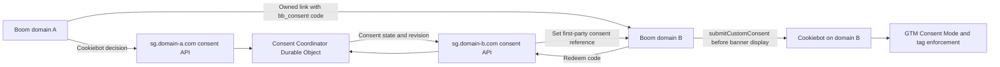

# Cookiebot Cross-Domain Consent Plan

## Status

- Planning document
- Created: July 17, 2026
- Selected CMP: Cookiebot Premium Small
- Estimated subscription: 4 domains at $16/domain/month, or $64/month total
- This document supersedes `termly-gtm-consent-plan.md` for the future CMP implementation. It does not authorize removing Termly until the Cookiebot rollout is ready.

## Outcome

Use Cookiebot for scanning, banner content, the Cookie Declaration, consent storage, consent records, and Google Consent Mode while showing a consent banner only on the first Boom-controlled domain an anonymous visitor encounters.

After the visitor responds, preserve that decision across these separate root domains:

```text
thebookkeepingchallenge.com
keyboardrichchallenge.com
keyboardrich.com
boomingbookkeeping.com
```

The cross-domain handoff must work without authentication and without relying on third-party cookies or third-party Local Storage.

## Required Behavior

1. The visitor sees the Cookiebot banner on the first Boom domain where no prior Boom consent can be established.
2. Accept all, reject all, and granular category selections transfer between the four root domains.
3. A destination domain receives the decision before optional tags are allowed to run.
4. The destination initializes Cookiebot silently and does not display its banner when valid transferred consent exists.
5. The destination stores its own first-party Cookiebot consent so refreshes and later visits do not require another transfer.
6. A first-time direct arrival with no local consent and no Boom consent reference sees the banner. There is no anonymous signal available to suppress it safely.
7. Changed or withdrawn consent becomes the current decision on every Boom domain the visitor has previously connected to the shared consent record.
8. Invalid, expired, or missing handoff data never grants optional consent.

## Decision Summary

| Area | Decision |
| --- | --- |
| CMP | Cookiebot Premium Small |
| Cookiebot organization | Put all four roots in one Domain Group using one CBID and one banner configuration |
| Cookie scanning | Use Cookiebot's automated scans and review unclassified trackers before launch |
| Cookie policy | Embed Cookiebot's automatically updated Cookie Declaration |
| Native cross-domain sharing | Do not depend on it; browser partitioning makes it unreliable across separate roots |
| Reliable cross-domain sharing | Use a first-party URL handoff backed by the existing Cloudflare Worker |
| URL contents | Carry only a short-lived, opaque, single-use code; never put raw categories or a Cookiebot Consent ID in the URL |
| Anonymous continuity | Store an opaque `bb_consent_ref` necessary cookie separately on each root after the first handoff |
| Central state | Store the current consent revision in a strongly consistent Cloudflare Durable Object |
| Cookiebot loading | Load Cookiebot directly from a small head bootstrap; do not also inject Cookiebot through GTM |
| Banner control | Resolve shared consent before loading Cookiebot; use Cookiebot's initialization event and `submitCustomConsent()` for a silent import |
| GTM | Default optional consent to denied, then let Cookiebot update Consent Mode and gate tags |
| Failure behavior | Keep optional tags denied and show the normal banner when consent cannot be established |

## Confirmed Cookiebot Capabilities

Cookiebot provides the following pieces needed by this plan:

- Multiple domains and Domain Groups.
- Automated cookie and tracker scanning.
- Automatic categorization and blocking support.
- An automatically updated Cookie Declaration.
- Consent records and reporting.
- GTM and Google Consent Mode integration.
- A custom HTML, CSS, and JavaScript banner template.
- `Cookiebot.submitCustomConsent(preferences, statistics, marketing)`.
- `Cookiebot.hide()`, `Cookiebot.show()`, `Cookiebot.renew()`, and `Cookiebot.withdraw()`.
- `CookiebotOnDialogInit`, which runs before banner content is compiled.
- `CookiebotOnConsentReady`, which runs when a submitted or stored consent state is ready.

Cookiebot does not publish an official signed-URL handoff product feature. The URL handoff and central anonymous consent record are Boom-owned integration code built around Cookiebot's documented browser API.

## Architecture



### Existing first-party hosts

Use the Worker already deployed or planned for these hosts:

```text
sg.thebookkeepingchallenge.com
sg.keyboardrichchallenge.com
sg.keyboardrich.com
sg.boomingbookkeeping.com
```

Each page calls the `sg.*` host under its own root. This makes the request first-party to that site and avoids a shared third-party cookie or iframe.

## Consent State

### Central record

The central record is an anonymous consent-continuity record, not a marketing identity.

```text
consentRef
revision
preferences
statistics
marketing
responseType        accepted | declined | custom | prompt_required
policyVersion
sourceDomain
cookiebotConsentId  optional reference to the originating Cookiebot record
createdAt
updatedAt
expiresAt
```

Do not store the visitor's name, email address, phone number, IP address, Segment anonymous ID, advertising IDs, attribution IDs, or browsing history in this record.

### First-party continuity cookies

The Worker sets these on each root after that root joins the shared record:

| Cookie | Purpose | Attributes |
| --- | --- | --- |
| `bb_consent_ref` | Identifies the anonymous central consent record | Necessary, random high-entropy value, `Secure`, `HttpOnly`, `SameSite=Lax`, root-domain scope |
| `bb_consent_applied_revision` | Identifies the central revision already applied locally | Necessary, `Secure`, `HttpOnly`, `SameSite=Lax`, root-domain scope |

These cookies must be documented as necessary and must never be reused for analytics, attribution, advertising, personalization, or account identification.

### Cookiebot state

Cookiebot remains responsible for the local consent state on each root. The Boom record coordinates the same decision between roots; it does not replace Cookiebot's first-party state or Cookiebot's consent records.

## Page Initialization

The consent bootstrap must be the first executable script in `<head>`.

### Initialization algorithm

```text
1. Set all optional Google Consent Mode values to denied.
2. Read and remove bb_consent from the current URL as early as possible.
3. Ask the current root's sg.* endpoint for shared consent:
   a. Redeem bb_consent when present.
   b. Otherwise check bb_consent_ref when this root already has one.
4. If shared consent is current:
   a. Register CookiebotOnDialogInit before loading Cookiebot.
   b. Load Cookiebot.
   c. Call submitCustomConsent with the transferred categories.
   d. Keep the banner hidden for this initialization.
   e. Wait for CookiebotOnConsentReady.
   f. Mark the central revision as applied on this root.
5. If no shared consent exists:
   a. Load Cookiebot normally.
   b. Let Cookiebot use local consent when present.
   c. Otherwise let Cookiebot display the banner.
6. Load or release GTM under the resulting consent state.
```

### Why Cookiebot is not loaded only through GTM

The destination must resolve a transferred decision before Cookiebot decides whether to display its banner. A small first-party bootstrap gives us deterministic ordering.

GTM remains responsible for tag enforcement, but it must not also inject a second Cookiebot instance.

### No-banner behavior

When valid shared consent exists:

- Cookiebot still initializes.
- Cookiebot receives the choice through `submitCustomConsent()`.
- Cookiebot stores first-party consent for the destination root.
- The banner is not rendered to the visitor.
- GTM receives the resulting consent state.

When no valid shared or local consent exists, Cookiebot renders normally.

## Worker API

Add the consent routes to `cloudflare-workers/reverse-proxy` while keeping the code separated into readable consent modules.

### Proposed endpoints

| Method | Path | Purpose |
| --- | --- | --- |
| `POST` | `/consent/state` | Create or update the central record after a Cookiebot decision |
| `GET` | `/consent/current` | Return the latest state for the current root's `bb_consent_ref` |
| `POST` | `/consent/handoff` | Mint an audience-bound, short-lived, single-use handoff code |
| `POST` | `/consent/redeem` | Atomically consume a code and attach the destination root to the shared record |
| `POST` | `/consent/applied` | Mark the central revision as successfully stored in destination Cookiebot state |
| `POST` | `/consent/prompt-required` | Propagate a full withdrawal that should require a fresh response |

### Durable Object

Use a SQLite-backed `ConsentCoordinator` Durable Object because code redemption and revision updates require strong consistency.

The initial implementation can use one named coordinator because expected Boom traffic is far below a single Durable Object's practical throughput. Do not add sharding until measurements justify it.

Required atomic operations:

- Create or update a consent record and increment its revision.
- Mint a handoff code with an expiry and destination audience.
- Redeem a code once.
- Reject second redemption.
- Expire old handoff codes.
- Expire consent records in line with the configured Cookiebot consent lifetime.

### Handoff-code rules

- Generate at least 128 bits of cryptographically random entropy.
- Store only a hash of the code in Durable Object storage.
- Default lifetime: five minutes.
- Bind the code to one destination root.
- Allow exactly one successful redemption.
- Preserve all three optional categories, including an all-false rejection.
- Include the source consent revision and policy version in the stored record.
- Return no Cookiebot Consent ID in the URL.

### CORS and request controls

- Allow only the configured Boom origin matching the current `sg.*` tenant.
- Use exact `Access-Control-Allow-Origin` values, not `*`.
- Require credentialed requests for endpoints that use the first-party consent-reference cookie.
- Reject requests whose `Origin` does not belong to the current tenant root.
- Validate request bodies and return generic errors.
- Rate-limit code creation and redemption.
- Set `Cache-Control: no-store` on all consent API responses.
- Never log handoff codes, consent references, or Cookiebot Consent IDs.

## URL Linker

### Owned links

The linker handles only navigation between the four configured roots.

```text
https://keyboardrichchallenge.com/vipfc-1?bb_consent=<opaque-code>
```

The code must be removed with `history.replaceState()` immediately after the bootstrap captures it. It must not remain in page analytics, browser-visible URLs, form submissions, or downstream redirects.

### Supported navigation types

- Normal anchor clicks.
- Links opened in a new tab.
- JavaScript navigation.
- ClickFunnels form redirects.
- ActiveCampaign form redirects.
- Intermediate redirects controlled by Boom.

### Linker API

Provide a small shared browser helper:

```text
decorateOwnedLinks()
withConsent(destinationUrl)
getConsentHandoff(destinationRoot)
```

The helper should use the existing first-party asset domains:

```text
assets.thebookkeepingchallenge.com
assets.keyboardrichchallenge.com
assets.keyboardrich.com
assets.boomingbookkeeping.com
```

### Forms and third-party redirect systems

For ActiveCampaign or ClickFunnels flows, submit the handoff code through a hidden field and include it in the configured destination URL.

This can follow the existing `ajs_aid` handoff pattern documented in `ACTIVE_CAMPAIGN_SEGMENT_CROSS_DOMAIN.md`, but consent and analytics identifiers must remain separate parameters and separate systems.

### Redirect preservation

Every Boom-controlled redirect between source and destination must preserve `bb_consent` until the final destination bootstrap consumes it.

Do not forward the code to domains outside the four-domain allowlist.

## Consent Changes and Withdrawal

### New or changed selection

When Cookiebot records a new choice on any root:

1. Read the resulting Cookiebot categories.
2. Send them to the current root's `/consent/state` endpoint.
3. Increment the central revision.
4. Mark the new revision as applied locally.
5. Future cross-domain navigation carries the current revision.
6. Previously connected roots discover and apply the new revision through `/consent/current`.

### Reject all

Reject all is a complete response and must transfer as:

```text
preferences = false
statistics  = false
marketing   = false
```

The destination must not show another banner merely because every optional category is false.

### Full withdrawal

If the user fully withdraws rather than choosing necessary-only:

1. Mark the central record `prompt_required`.
2. Keep all optional Consent Mode values denied.
3. Clear or withdraw local Cookiebot consent as appropriate.
4. Show the banner on the next active Boom domain so the visitor can make a fresh choice.

### Change-preferences control

Every root must provide a visible footer link or Cookiebot Privacy Trigger that opens `Cookiebot.renew()`.

## Cookiebot Configuration

### Domain Group

Create one Domain Group containing the canonical forms of all four roots. Avoid registering both `www` and apex as separate billable domains unless Cookiebot requires it for a real independently scanned site.

Use the same CBID and configuration across the four roots.

### Banner content

The first banner must clearly say that the visitor's selection applies to all four named Boom-controlled domains.

The categories and disclosed purposes must cover trackers used anywhere in the Domain Group, not only the first domain encountered.

### Native cross-domain feature

Cookiebot's native Cross-domain Consent Sharing may be enabled as a best-effort convenience, but it is not the source of truth for this implementation.

The custom Worker handoff must continue to work when third-party cookies or third-party Local Storage are unavailable and when the visitor rejects the Preferences category.

### Scanning and categorization

Before launch:

1. Complete a scan for all four roots.
2. Review every unclassified cookie and tracker.
3. Review dynamically triggered trackers that a crawler may not encounter.
4. Add the Boom consent-continuity cookies as Necessary.
5. Confirm the Cookie Declaration includes the expected provider, purpose, category, and expiry for each item.
6. Repeat the scan after the production GTM container is published.

### Cookie Declaration

Embed the Cookiebot Cookie Declaration on the cookie-policy location used by each root. Cookiebot will update its detected-cookie list after future scans.

## GTM and Consent Mode

### Default state

Set these defaults before GTM loads:

| Consent type | Default |
| --- | --- |
| `analytics_storage` | `denied` |
| `ad_storage` | `denied` |
| `ad_user_data` | `denied` |
| `ad_personalization` | `denied` |
| `functionality_storage` | `denied` |
| `personalization_storage` | `denied` |
| `security_storage` | `granted` |

### Category mapping

| Cookiebot category | GTM consent types |
| --- | --- |
| Necessary | `security_storage` |
| Preferences | `functionality_storage`, `personalization_storage` |
| Statistics | `analytics_storage` |
| Marketing | `ad_storage`, `ad_user_data`, `ad_personalization` |

### Tag rules

- Google tags use their built-in Consent Mode behavior.
- Non-Google analytics tags require `analytics_storage`.
- Non-Google advertising and affiliate tags require `ad_storage`.
- Functional embeds require `functionality_storage` unless they are genuinely necessary.
- Necessary security and form-protection tags do not require optional consent.
- Page-specific conversion tags need deduplication before any consent-update fallback trigger is added.
- Use Cookiebot's consent-update event for tags that need to react after an in-page decision.

The provider inventory and initial mappings in `termly-gtm-consent-plan.md` remain useful, but the category names must be translated to the Cookiebot mapping above.

## Failure Behavior

| Failure | Required behavior |
| --- | --- |
| No handoff code and no local/shared record | Show Cookiebot banner; optional tags stay denied |
| Invalid handoff code | Ignore code, remove it from URL, show banner if no local consent |
| Expired handoff code | Same as invalid code |
| Replayed handoff code | Reject redemption; do not grant consent |
| Consent API unavailable | Keep optional tags denied; use valid local Cookiebot state only if policy allows, otherwise show banner |
| Cookiebot CDN unavailable | Keep optional tags denied; do not run optional tags |
| GTM unavailable | Cookiebot consent remains stored; no GTM-managed optional tags run |
| Central revision newer than local | Keep optional tags denied until the newer revision is applied |
| Policy version changed materially | Mark shared state `prompt_required` and collect a fresh response |

## Implementation Phases

### Phase 1: Cookiebot account and inventory

- Purchase or trial Cookiebot Premium.
- Add all four roots to one Domain Group.
- Configure the US and any required non-US banner rules.
- Run initial scans.
- Review tracker categorization.
- Configure the shared-domain disclosure text.
- Record the CBID and policy version.

### Phase 2: Consent API

- Add the `ConsentCoordinator` Durable Object binding and migration.
- Add the six consent endpoints.
- Add exact-origin CORS and credential handling.
- Add validation, expiry, atomic redemption, and cleanup.
- Add unit tests for all consent states and failure paths.
- Deploy endpoints before activating the linker.

### Phase 3: Browser bootstrap

- Create the first-party consent bootstrap asset.
- Set Consent Mode defaults before GTM.
- Resolve local/shared/handoff state.
- Initialize Cookiebot exactly once.
- Submit transferred consent silently.
- Remove `bb_consent` from the URL.
- Record the applied revision.

### Phase 4: Cross-domain linker

- Decorate allowlisted anchor links.
- Support new-tab navigation.
- Add a Promise-based helper for JavaScript redirects.
- Add the hidden-field flow for ActiveCampaign and ClickFunnels.
- Confirm intermediate redirects preserve the code.

### Phase 5: GTM enforcement

- Remove the Termly CMP tag only when Cookiebot is ready to replace it.
- Ensure Cookiebot is not loaded a second time through GTM.
- Configure Consent Mode mappings.
- Add Additional Consent Checks to non-Google tags.
- Add deduplication to conversion tags that can fire after a consent update.
- Publish through a controlled GTM version.

### Phase 6: Cookie Declaration and preference controls

- Embed the Cookie Declaration on each relevant site.
- Add the change-preferences link or Privacy Trigger on every root.
- Confirm all four domains are named in the consent scope.
- Confirm the Boom necessary consent cookies appear in the declaration.

### Phase 7: Controlled rollout

- Enable the bootstrap with handoff redemption but linker creation disabled.
- Confirm ordinary local Cookiebot behavior on every root.
- Enable handoff creation for one source-to-destination path.
- Expand to the remaining root-domain pairs.
- Remove Termly only after Cookiebot and GTM behavior is correct across all four roots.

## Acceptance Criteria

### Banner behavior

- [ ] A new visitor sees one banner on the first Boom domain encountered.
- [ ] Accept all transfers without a destination banner.
- [ ] Reject all transfers without a destination banner.
- [ ] Every granular category combination transfers exactly.
- [ ] Refreshing the destination does not show the banner again.
- [ ] A first-time direct visitor with no shared signal sees the banner.
- [ ] No destination-banner flash is visible during a valid handoff.

### Consent enforcement

- [ ] Optional Consent Mode values start denied.
- [ ] No nonessential browser tag runs before the decision is ready.
- [ ] Statistics-only consent releases analytics but not marketing tags.
- [ ] Marketing denial blocks browser pixels and related server forwarding.
- [ ] Reject all allows only necessary behavior.
- [ ] Consent changes update tag behavior without duplicate conversions.

### Handoff security

- [ ] The URL contains only an opaque code.
- [ ] The code is destination-bound.
- [ ] The code expires after five minutes.
- [ ] The code succeeds once and fails on replay.
- [ ] The parameter is removed before analytics records the page URL.
- [ ] Codes and consent references are absent from Worker logs.
- [ ] External links never receive the code.

### Change and withdrawal

- [ ] A changed selection creates a new central revision.
- [ ] A previously connected root applies the new revision on a direct return.
- [ ] Reject-all updates propagate as a valid response.
- [ ] Full withdrawal sets `prompt_required` and keeps optional tags denied.
- [ ] Every root provides an accessible way to change preferences.

### Browser coverage

- [ ] Chrome desktop and Android.
- [ ] Safari desktop and iOS.
- [ ] Firefox desktop.
- [ ] Brave desktop.
- [ ] Normal navigation and new-tab navigation.
- [ ] Private browsing where storage is permitted for the current session.

### Cookiebot operations

- [ ] All four domains scan successfully.
- [ ] No important tracker remains unclassified.
- [ ] The Cookie Declaration updates from scan results.
- [ ] Consent records exist for banner submissions.
- [ ] Imported destination state uses the same categories as the originating decision.

## Operational Monitoring

Collect counts without logging identifiers:

```text
consent_state_created
consent_state_updated
handoff_created
handoff_redeemed
handoff_expired
handoff_replayed
handoff_invalid_audience
cookiebot_import_succeeded
cookiebot_import_failed
banner_displayed_with_handoff_present
```

Alert on:

- A sustained increase in import failures.
- Any banner display after successful handoff redemption.
- Consent endpoints returning elevated 5xx responses.
- Cookiebot scan failures or newly unclassified trackers.
- A GTM release that causes optional tags to run under denied consent.

## Rollback

Keep the Cookiebot bootstrap and linker behind independent configuration flags.

Rollback order:

1. Disable new handoff-code creation.
2. Keep redemption enabled temporarily so issued codes can complete.
3. Fall back to normal per-domain Cookiebot banners with optional consent denied by default.
4. Roll back the GTM container if tag enforcement is incorrect.
5. Do not restore Termly and Cookiebot simultaneously on the same page.

## External References

- [Cookiebot cross-domain consent sharing](https://support.cookiebot.com/hc/en-us/articles/360003792573-Cross-domain-Consent-Sharing-in-the-Cookiebot-Admin)
- [Cookiebot developer API](https://www.cookiebot.com/us/developer/)
- [Cookiebot custom banner documentation](https://support.cookiebot.com/hc/en-us/articles/360003921454-Can-I-build-my-own-fully-customized-cookie-consent-banner-Cookiebot-Admin)
- [Cookiebot Cookie Declaration](https://support.cookiebot.com/hc/en-us/articles/26380698111388-What-is-included-in-the-Cookie-Declaration-Cookiebot-Manager)
- [Cookiebot pricing](https://www.cookiebot.com/us/pricing/)
- [Practitioner discussion of Cookiebot consent transfer through URL parameters](https://www.linkedin.com/posts/luc-nugteren_cookiebots-cross-domain-sharing-doesnt-activity-7313447693916209152-0Ncw)

## Implementation Decisions Still Needed

These choices do not block the plan but must be set before coding:

1. Confirm the canonical `www` or apex hostname for each root.
2. Choose the initial Cookiebot consent lifetime, recommended at 12 months unless policy requires less.
3. Define the first `policyVersion` value and the conditions that force a new response.
4. Confirm which US states and non-US regions need distinct Cookiebot banner behavior.
5. Choose the first production funnel path for the controlled rollout.
