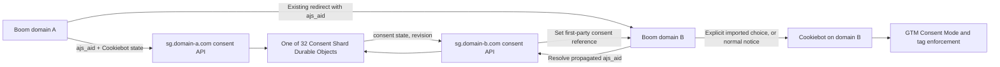

# Cookiebot Cross-Domain Consent Plan

## Status

- Planning document
- Created: July 17, 2026
- Revised: July 25, 2026 after the Phase 0 spike and implementation review: only explicit choices transfer; the Worker uses two consent endpoints, 32 shards, a signed state cookie with database fallback, and no cross-root polling in version 1
- Selected CMP: Cookiebot Premium Small
- Primary consent model: US opt-out; visitors are opted in by default unless they opt out or send a recognized opt-out signal such as GPC
- Estimated subscription: 4 domains at $16/domain/month, or $64/month total
- This document supersedes `termly-gtm-consent-plan.md` for the future CMP implementation. It does not authorize removing Termly until the Cookiebot rollout is ready.

## Outcome

Use Cookiebot for scanning, banner content, the Cookie Declaration, consent storage, consent records, and Google Consent Mode. When a visitor makes an explicit choice — opt in, opt out, or a custom category selection — on any Boom-controlled domain, that choice transfers silently to the other domains and no further notice is shown there. A visitor who has not responded sees the notice on each root they visit; the Phase 0 spike proved Cookiebot stores no state for an unanswered notice, so there is nothing valid to transfer in that case.

Preserve explicit choices across these separate root domains:

```text
thebookkeepingchallenge.com
keyboardrichchallenge.com
keyboardrich.com
boomingbookkeeping.com
```

The cross-domain handoff must work without authentication and without relying on third-party cookies or third-party Local Storage. It will reuse the existing Jitsu/Segment-compatible `ajs_aid` and `an_aid` pass-through that already survives Boom's links, forms, and redirect chains.

## Required Behavior

1. The visitor sees the Cookiebot US opt-out notice on every Boom domain where no explicit choice can be established, locally or through the shared record.
2. In configured US opt-out regions, optional categories are granted by default unless the visitor opts out or sends a recognized opt-out signal such as Global Privacy Control.
3. Explicit opt-ins, explicit opt-outs, and granular category selections transfer between the four root domains. An unanswered notice transfers nothing and is never converted into an acceptance.
4. A destination domain reads the propagated `ajs_aid`/`an_aid` identity, then receives the shared state before its local Cookiebot notice is displayed or its GTM state is finalized.
5. The destination initializes Cookiebot silently through `submitCustomConsent()` and does not display its notice when a valid transferred explicit choice exists.
6. The destination stores its own first-party Cookiebot state so refreshes and later visits do not require another transfer.
7. A first-time direct arrival with no local state and no propagated `ajs_aid` sees the notice. A destination reached through an existing Jitsu cross-domain handoff uses `ajs_aid` to recover shared state.
8. Changed consent or an opt-out becomes the current decision on another Boom domain the next time that domain loads or reloads. Version 1 does not poll already-open tabs on other roots.
9. Invalid or missing continuity data never overrides Cookiebot's applicable regional defaults.
10. An active GPC signal on the destination overrides a transferred opt-in for the affected purposes.

## Decision Summary

| Area | Decision |
| --- | --- |
| CMP | Cookiebot Premium Small |
| Consent model | US opt-out by default; GPC and explicit opt-outs override the default |
| Cookiebot organization | Put all four roots in one Domain Group using one CBID and one banner configuration |
| Cookie scanning | Use Cookiebot's automated scans and review unclassified trackers before launch |
| Cookie policy | Embed Cookiebot's automatically updated Cookie Declaration |
| Native cross-domain sharing | Disabled; browser partitioning makes it unreliable across separate roots |
| Reliable cross-domain sharing | Reuse the existing `ajs_aid` URL propagation and resolve consent through the existing first-party Cloudflare Worker |
| URL contents | Keep the existing high-entropy `ajs_aid`; never add consent state to the URL |
| Anonymous continuity | Reuse the existing authoritative `__eventn_id_srvr` identity cookie and set one signed `bb_consent_state` necessary cookie on each root after resolution |
| Central state | Use 32 strongly consistent Durable Object shards selected from the subject-key prefix; each shard stores compact consent rows for its assigned subjects |
| Cookiebot loading | Load Cookiebot directly from a small head bootstrap; do not also inject Cookiebot through GTM |
| Banner control | Resolve shared state before loading Cookiebot; import only explicit choices with `submitCustomConsent()`. A visitor who has not responded sees the notice on each root — the spike proved Cookiebot stores nothing for a suppressed unanswered notice |
| GTM | GTM may load immediately, but every optional tag fires only from the consent-update event after the resolved Consent Mode state has been set. No optional tag uses Initialization or All Pages |
| Failure behavior | If consent is unresolved, emit no consent-update event, so no optional GTM tag fires |
| Cross-root updates | Resolve the newest central state on page load or reload; do not poll already-open tabs on other roots |

## Verified Cookiebot Behavior

Verified by the Phase 0 spike (`COOKIEBOT_PHASE0_SPIKE_RESULTS.md`):

- `Cookiebot.submitCustomConsent(preferences, statistics, marketing)` works before the dialog renders, saves the choice in Cookiebot's first-party cookie, shows no notice, and survives reload. This is the transfer mechanism for both opt-ins and opt-outs.
- Hiding an unanswered notice (via `Cookiebot.hide()` or CSS) stores **no** consent state, produces no Consent Mode update, and does not register GPC. Suppressing the notice for a non-responder is therefore not viable and must not be attempted.
- One Domain Group with one CBID and one banner configuration covers all four production roots.
- Cookiebot admin reporting of imported choices lagged during the spike; the central record remains the runtime audit trail (see Central record).

Also relied on, per Cookiebot documentation: automated scanning and categorization, the auto-updated Cookie Declaration, GTM and Google Consent Mode integration, `renew()`/`withdraw()`, and the `CookiebotOnDialogInit`/`CookiebotOnConsentReady` events.

Cookiebot does not publish an official identity-based handoff for this setup. Boom's existing Jitsu cross-domain identity propagation supplies the anonymous continuity signal; the Worker and Cookiebot browser API supply consent resolution and local enforcement.

## Architecture



### Existing first-party hosts

Use the Worker already deployed or planned for these hosts:

```text
sg.thebookkeepingchallenge.com
sg.keyboardrichchallenge.com
sg.keyboardrich.com
sg.boomingbookkeeping.com
```

Each page calls the `sg.*` host under its own root. This makes the request first-party to that site and avoids a shared third-party cookie or iframe.

## Consent State

### Central record

The central record is an anonymous consent-continuity record. The Worker receives the existing Jitsu anonymous ID transiently and immediately derives `subjectKey = HMAC-SHA-256(secret, normalizedAjsAid)`. Only `subjectKey` is used to address or store consent state.

```text
consentRef
subjectKey          HMAC of ajs_aid; never the raw Jitsu ID
revision
preferences
statistics
marketing
responseType        opted_in | opted_out | custom
gpcApplied
policyVersion
sourceDomain
createdAt
updatedAt
expiresAt
```

Do not store the visitor's name, email address, phone number, IP address, raw Jitsu/Segment anonymous ID, advertising IDs, attribution IDs, or browsing history in this record. Do not join `subjectKey` back to analytics data.

A record is created only when the visitor makes an explicit choice: opt in, opt out, or a custom category selection. Cookiebot withdrawal is stored as an all-false opt-out. Visitors who never respond to the notice have no record — there is no state worth transferring for them, and they see the notice on each root they visit. This removes any need to coordinate which domain shows the notice.

The record doubles as the runtime audit trail for imported choices, since Cookiebot's admin reporting of `submitCustomConsent()` submissions lagged during the spike: it carries the category values, the response type, when and where the original choice was made (`sourceDomain`, `createdAt`), and the policy version.

### First-party consent-state cookie

The existing authoritative `__eventn_id_srvr` cookie identifies the subject.
After resolving the central record, the Worker also sets one compact signed
cookie:

| Cookie | Purpose | Attributes |
| --- | --- | --- |
| `bb_consent_state` | Signed fast-path containing the three category values, revision, policy version, and expiration | Necessary, compact authenticated value, `Secure`, `HttpOnly`, `SameSite=Lax`, root-domain scope |

The Worker verifies the signature before using the cookie. If the cookie is
missing, expired, or invalid, the Worker resolves `__eventn_id_srvr`, looks up
the central record, enforces that result, and refreshes `bb_consent_state`. If
no authoritative state can be resolved, an optional event is not forwarded.

This cookie must be documented as necessary and must never be reused for
analytics, attribution, advertising, personalization, or account
identification.

### Cookiebot state

Cookiebot remains responsible for the local consent state on each root. The Boom record coordinates the same decision between roots; it does not replace Cookiebot's first-party state or Cookiebot's consent records.

## Page Initialization

The consent bootstrap must be the first executable script in `<head>`.

### Initialization algorithm

```text
The consent round trip does not block Jitsu identity initialization, but
optional analytics events wait for the resolved consent-update event.

1. Load GTM immediately. Every optional tag is configured to fire only from
   the consent-update event. No optional tag uses Initialization, All Pages, or
   another page-load trigger.
2. Initialize the Jitsu identity bridge without sending a page event. The Jitsu
   page event follows the same consent-update trigger as every other optional
   analytics tag.
3. Read and validate matching ajs_aid/an_aid values from the URL.
4. In parallel with the above, POST the available handoff identity, current domain, GPC status, and policy version to the current root's /consent/bootstrap endpoint, with a timeout of about one second. On timeout or failure, follow the Consent API unavailable rule. If no URL handoff exists, the endpoint uses the current root's authoritative __eventn_id_srvr cookie.
5. The endpoint reuses the Worker's existing anonymous-identity resolver, sets or repairs the Jitsu cookie pair, derives the HMAC subject key, applies the divergent-subject merge when the handoff and local subjects differ, and atomically returns:
   a. The latest explicit consent state and revision, or no-record.
   b. A refreshed signed bb_consent_state cookie when a record exists.
6. If a valid local Cookiebot CookieConsent cookie already exists on this root, Cookiebot initializes from it without waiting for the bootstrap response; when the response arrives, any newer central revision is applied in place through the standard consent-update path.
7. Otherwise the banner decision waits for the bootstrap response. If it returns a valid explicit choice (opted_in, opted_out, or custom):
   a. Check GPC first: an active applicable GPC signal keeps the affected purposes denied regardless of a transferred opt-in.
   b. Register CookiebotOnDialogInit before loading Cookiebot, then load Cookiebot.
   c. Call submitCustomConsent with the transferred categories (as adjusted by GPC) before the dialog renders.
   d. Wait for CookiebotOnConsentReady; no notice is shown.
8. If the response is no-record:
   a. Load Cookiebot normally.
   b. Let Cookiebot display the applicable notice and apply its regional behavior.
   c. Do not fabricate a choice; an unanswered notice stores nothing and transfers nothing.
9. After Cookiebot's resulting state is known, set the final Consent Mode
   values first, then emit the consent-update event. Every optional Google and
   non-Google tag uses that event, category checks, and deduplication. Until the
   event is emitted, no optional GTM tag fires.
```

### US opt-out default

For visitors covered by the configured US opt-out banner:

- Cookiebot resolves optional categories as granted by default while the notice is displayed.
- An explicit opt-out changes the affected categories to denied.
- A recognized GPC signal overrides the default where applicable.
- The shared record carries explicit choices only. A visitor who has not responded sees the notice on each root; there is no cross-domain suppression for non-responders.
- A resolved `ajs_aid` record with an explicit choice prevents the notice from appearing on the destination.

Before Cookiebot resolves the visitor's region and shared state, the bootstrap
emits no consent-update event. Optional GTM tags remain idle because they have
no page-load triggers.

The end-to-end test before rollout must confirm when Cookiebot pushes the granted Consent Mode update for a non-responder on the normal notice path — immediately on display or only after interaction — because that timing determines how much data the silent majority produces.

### Why Cookiebot is not loaded only through GTM

The destination must resolve a transferred decision before Cookiebot decides whether to display its banner. A small first-party bootstrap gives us deterministic ordering.

GTM remains responsible for tag enforcement, but it must not also inject a second Cookiebot instance.

### No-banner behavior

When a valid transferred explicit choice exists:

- Cookiebot still initializes.
- The choice — opt-in, opt-out, or custom categories — is applied through `submitCustomConsent()` before the dialog renders, with GPC checked first.
- Cookiebot stores first-party consent for the destination root.
- The banner is not rendered to the visitor.
- GTM receives the resulting consent state.

When no explicit shared or local choice exists, Cookiebot renders normally and shows the notice. An unanswered notice is never converted into an acceptance.

## Worker API

Add the consent routes to `cloudflare-workers/reverse-proxy` while keeping the code separated into readable consent modules.

### Proposed endpoints

| Method | Path | Purpose |
| --- | --- | --- |
| `POST` | `/consent/bootstrap` | Reuse the existing `ajs_aid`/`an_aid` identity resolver, set the authoritative Jitsu cookies, return the explicit consent state or no-record, and refresh the signed consent-state cookie |
| `POST` | `/consent/state` | Create or update the subject's record after an explicit opt-in, opt-out, category change, or GPC result |

### Durable Object

Use 32 SQLite-backed `ConsentShard` Durable Objects because concurrent revision updates require strong consistency, while one SQLite object per anonymous ID would waste storage on per-database overhead.

Derive a shard number from the first five bits of `subjectKey`, then route with `env.CONSENT_SHARD.getByName("consent-v1-" + shardNumber)`. Store `subjectKey` as the primary key within that shard. The same subject always reaches the same serialized storage boundary, while traffic and rows spread evenly across 32 objects.

Thirty-two shards are the selected balance: they provide substantial storage and traffic headroom while still requiring only one Durable Object class, one namespace, and one deterministic routing function.

Keep the implementation compact:

- Store the 32-byte HMAC subject key as a `BLOB` primary key, not hexadecimal text.
- Store category choices as a small integer bitmask and timestamps as integer epoch values.
- Avoid JSON and secondary indexes except the expiry index required for cleanup.
- Treat the routing rule as versioned and immutable: `consent-v1-0` through `consent-v1-31`.
- Keep each RPC operation to synchronous SQLite statements with no external I/O inside the Durable Object.
- Delete expired rows in bounded batches so cleanup never monopolizes a shard.

Required atomic operations:

- Apply a divergent-subject merge result to the surviving subject as one write with a revision increment.
- Create or update a consent record and increment its revision.
- Expire affirmative consent records after 12 months. Do not automatically
  expire an opt-out into an opt-in.

### Capacity check using production page traffic

Source: `able-folio-499722.boom_domains.pages_view`, trailing 14 days queried on July 17, 2026.

| Measurement | Observed value |
| --- | ---: |
| Pageviews | 431,797 |
| Average pageviews/day | 30,843 |
| Unique anonymous IDs | 304,707 |
| Peak pageviews/second | 27 |
| Peak pageviews/minute | 245 |
| Visitors observed on multiple roots | 15,787 |
| Pageviews from multi-root visitors | 59,040 |
| Observed cross-root transitions | 21,610 |
| Peak cross-root transitions/second | 3 |
| Peak cross-root transitions/minute | 9 |

Cloudflare documents a soft limit of approximately 1,000 simple requests per second for one Durable Object, a 10 GB SQLite limit per object, and unlimited SQLite-backed object count on Workers Paid. A single global object could handle the observed request rate, but 32 deterministic shards provide 320 GB of total storage headroom and spread load without creating millions of databases.

Records are created only for explicit choices, so the stored population is a small fraction of all anonymous IDs — the estimates below assumed a record for every visitor and are therefore a strict upper bound. Lookup calls still occur per root/session; writes occur only on state changes.

The original 7.8-million figure was a linear annualization of the July 17 14-day distinct-ID count: `304,707 × 30 / 14 × 12`. It was a current-rate planning estimate, not a true upper bound.

A July 22 recheck found that the table currently contains only about 27 days of data, from June 22 through July 19. The most recent 14 days contained 320,727 distinct IDs; the available preceding-window data contained 299,173; and only 11,897 appeared in both. That leaves 308,830 IDs newly observed in the recent window relative to the available prior data. Annualizing that new-ID rate gives approximately `308,830 × 365 / 14 = 8.05 million` retained subjects under unchanged traffic and identity churn. Because the older comparison window is partially truncated, treat this as a conservative capacity baseline rather than a precise forecast.

Use 8.1 million as the current-rate baseline, not as a ceiling:

| Scenario | Retained subjects/year | Average rows/shard |
| --- | ---: | ---: |
| Current observed rate | 8.1 million | 253,000 |
| 2× traffic or identity churn | 16.1 million | 503,000 |
| 5× traffic or identity churn | 40.3 million | 1,260,000 |

All three scenarios remain far below 10 GB per shard with a compact schema. Cloudflare notes that an empty SQLite Durable Object itself uses approximately 12 KB, which is why fixed sharding is preferable to millions of one-row objects. Delete expired affirmative records while retaining recognizable opt-outs until the visitor changes the choice or the governing retention policy permits deletion.

### Rolling retention

There is no annual bulk deletion date. Retention depends on the stored response type:

- Affirmative consent records (`opted_in`, granting `custom`) use Cookiebot's configured rolling lifetime, initially 12 months from the decision.
- Ordinary pageviews do not extend that lifetime; otherwise active visitors would never reach renewal.
- When an affirmative record expires, treat it as missing during lookup; the next Boom domain the visitor reaches shows the applicable notice.
- Explicit opt-outs, category denials that implement a sale/sharing opt-out, and applicable GPC opt-outs must not automatically turn back into default opt-in after 12 months. Retain those states until the visitor later authorizes the affected processing or the governing retention policy permits deletion.
- A material policy-version change may require earlier renewal, but it must not silently erase an existing opt-out.
- Each shard deletes eligible expired rows in small daily batches. There is no once-a-year table wipe.
- Align local cookies and Cookiebot renewal for expiring affirmative/default records while preserving the necessary shared reference used to honor an active opt-out.

The 8.1-million annual estimate models the 12-month rolling population of ordinary records. Non-expiring active opt-outs add cumulatively until changed or lawfully removed, so track them separately in capacity metrics.

### Opt-out storage location

Keep an opt-out in the same subject row and the same HMAC-selected shard as every other consent state. Do not move opt-outs into a separate global Durable Object.

This preserves one deterministic lookup and one source of truth:

1. Derive the subject HMAC.
2. Select the shard from the first five bits.
3. Read that subject's row.
4. Apply its current state, whether `opted_in`, `opted_out`, or `custom`.

Changing from opted in to opted out is an atomic update to that row with `revision = revision + 1`; it is not a copy or move between databases. A separate opt-out object would require a second lookup on every request, create races between two records, and concentrate permanent records in one storage boundary.

For operations, each shard reports its count of active opt-outs alongside total rows. Aggregate those 32 counts for dashboards. Cookiebot remains the consent/audit reporting system; the sharded record is the runtime source used to enforce continuity.

### Shard distribution and collision risk

The first five bits of an HMAC-SHA-256 output are uniformly distributed even when incoming Jitsu IDs are not. Sharing the same five-bit prefix is intentional: it selects one of 32 databases. The full 32-byte HMAC remains the row primary key, so subjects assigned to the same shard do not overwrite each other.

At the 8.1-million current-rate baseline, each shard has approximately 253,000 rows. The statistical standard deviation is about 495 rows, or 0.20%. Natural shard imbalance should therefore remain around 1% or less across the fullest and least-full shards. A full 256-bit HMAC collision at this scale remains on the order of 10^-64 and is not an operational concern.

Each shard must expose a protected administrative stats RPC that returns row count and SQLite page usage. Collect those values daily without identifiers and alert when:

- Any shard exceeds 5 GB, half of Cloudflare's 10 GB per-object limit.
- Any shard's row count differs from the 32-shard mean by more than 10%.
- Expired-row cleanup falls behind by more than one day.
- A shard shows abnormal write rate, which may indicate abuse or a routing bug.

Rate limits prevent an attacker from creating unbounded identities. Because the shard is selected after secret-key HMAC, a caller cannot deliberately choose a target shard. If storage ever approaches the alert threshold, introduce a versioned `consent-v2` router with more shards, dual-read old and new versions, and migrate records gradually; do not change the `consent-v1` mapping in place.

### Identity-key rules

- Accept `ajs_aid`/`an_aid` only from exact allowlisted Boom origins through their matching first-party `sg.*` host.
- Reuse `getHandoffIdentity()`, `resolveAnonymousIdentity()`, `normalizeAnonymousId()`, and `getAnonymousIdCookieHeaders()` from the existing reverse proxy instead of creating different identity precedence rules.
- Reject the handoff when both parameters exist and differ, matching current Jitsu behavior.
- Normalize and validate the identifier length and format.
- Derive `subjectKey` with HMAC-SHA-256 using a Worker secret.
- Configure one stable Worker HMAC secret and back it up. Key rotation and record migration are outside version 1.
- Never store or log the raw `ajs_aid` in the consent service.
- Never store consent categories or consent revisions in the URL.
- Keep Jitsu event collection and consent resolution separate even though the same anonymous continuity signal bootstraps both.
- Preserve all three optional categories, including an all-false rejection.
- Include the policy version in every stored record.

### Divergent-subject merge

The existing resolver lets a URL handoff identity override the local `__eventn_id_srvr` cookie. A visitor who used two roots independently before ever crossing between them therefore has two different subject keys. Adopting the handoff subject blindly could revert an explicit opt-out: the visitor opts out on root B directly, later arrives at B through a link from root A carrying A's opted-in (or record-less) identity, and B would silently return to opted in while the opt-out sits orphaned under B's old subject key.

When `/consent/bootstrap` receives both a URL handoff identity and a local `__eventn_id_srvr` cookie that resolve to different subjects:

1. Read both subject records; a missing record counts as no restriction but also as no grant.
2. Merge with most-restrictive-wins: `opted_out` beats `custom`, which beats `opted_in`, which beats no record. When both records carry categories, a category denied in either record stays denied.
3. Write the merged state to the surviving subject, the handoff subject that the Jitsu identity converges to, as a new revision.
4. Keep `gpcApplied` true in the merged record if either source record had it.
5. Do not durably link the two subject keys and do not delete the old record early; it expires under normal retention.

The two subjects usually map to different shards, so the merge is not a cross-shard transaction: read the old subject's record from its shard, then perform one atomic write to the surviving subject's shard. This is safe because the old record is never modified and the merge only ever adds restrictions.

An explicit opt-out must never be downgraded by a merge. This rule is a launch requirement, not an enhancement.

### CORS and request controls

- Allow only the configured Boom origin matching the current `sg.*` tenant.
- Use exact `Access-Control-Allow-Origin` values, not `*`.
- Require credentialed requests for endpoints that use the first-party identity
  or consent-state cookie.
- Reject requests whose `Origin` does not belong to the current tenant root.
- Validate request bodies and return generic errors.
- Rate-limit bootstrap and state mutation by origin and subject.
- Set `Cache-Control: no-store` on all consent API responses.
- Never log raw `ajs_aid` values, consent references, or HMAC subject keys.

## Existing Jitsu Identity Bridge

No second cross-domain linker is required. The consent bootstrap consumes the existing Segment-compatible `ajs_aid` and Jitsu `an_aid` flow documented in `ACTIVE_CAMPAIGN_SEGMENT_CROSS_DOMAIN.md` and `cloudflare-workers/reverse-proxy/JITSU_CLOUD_PROXY_MIGRATION.md`.

This covers the redirects already handled by that system, including the ActiveCampaign and ClickFunnels form flow, without knowing the final destination when the form is submitted. The form and redirect infrastructure continues propagating the anonymous ID; the destination consent bootstrap resolves it before Cookiebot or Jitsu initializes.

Requirements:

- Run `/consent/bootstrap` in parallel with page initialization; it must complete or time out before the banner decision, but Jitsu does not wait for it.
- Pass matching `ajs_aid`/`an_aid` values to the first-party endpoint using the same validation and precedence as the existing `/p.js` bootstrap.
- `/consent/bootstrap` and `/p.js` share the same identity resolver and cookie repair, so either may establish `__eventn_id` and the authoritative HttpOnly `__eventn_id_srvr` first; both must produce the same result.
- Remove the URL identity parameters according to the existing tracking implementation only after consent bootstrap and Jitsu initialization have captured them.
- Do not add consent categories to the existing redirect URL.
- Do not forward `ajs_aid` beyond the destinations already authorized by the existing cross-domain tracking design.
- After a root resolves the subject, ensure its authoritative Jitsu identity
  cookie and signed consent-state cookie are current so later bookmarked or
  direct returns do not depend on another redirect.

If Jitsu event delivery is disabled after an opt-out, the small identity pass-through needed to locate the shared opt-out must continue independently of sending analytics events. The consent service stores only the HMAC subject key and must not join it to Jitsu event data.

### Worker ingest enforcement

Every Jitsu event flows through the same `sg.*` proxy that hosts the consent
service. On event ingestion, the Worker verifies `bb_consent_state` locally and
enforces its category values without a database lookup.

If the signed cookie is missing, expired, or invalid, the Worker resolves the
authoritative identity cookie, performs one central database lookup, enforces
that result, and refreshes `bb_consent_state`. If neither the cookie nor the
database provides an authoritative state, the optional event is not forwarded.

The browser also sends Jitsu events only after the resolved consent-update
event grants Statistics. The Worker check is a server-side backstop rather than
the primary tag trigger.

Browser pixels cannot be filtered at the proxy because they call third parties directly; they are protected instead by firing only on resolved consent state through GTM, per the initialization algorithm.

## Consent Changes and Withdrawal

### New or changed selection

When Cookiebot records an opt-out or a new category choice on any root:

1. Read the resulting Cookiebot categories.
2. Send them to the current root's `/consent/state` endpoint.
3. Increment the central revision.
4. Mark the new revision as applied locally.
5. Future cross-domain navigation carries the same `ajs_aid`; the destination resolves the newest central revision.
6. Another root discovers and applies the new revision on its next page load or reload through `/consent/bootstrap`. Version 1 does not poll already-open tabs on other roots.

### Opt out or reject all

An opt-out or reject-all choice is a complete response and must transfer as:

```text
preferences = false
statistics  = false
marketing   = false
```

The destination must not show another notice merely because every optional category is false.

### Global Privacy Control

When Cookiebot recognizes an applicable GPC signal:

1. GPC overrides the ordinary US default-opt-in state for the affected purposes.
2. Persist that result in the subject's central record immediately.
3. Check GPC before applying any transferred opt-in on a destination: an active applicable GPC signal keeps the affected purposes denied regardless of the transferred choice.
4. Keep the applicable advertising, sale, or sharing signals denied.

### Withdrawal

Cookiebot withdrawal is the same shared state as reject all:

```text
preferences = false
statistics  = false
marketing   = false
```

Store it through `/consent/state` as an explicit opt-out. Do not erase the
answer or force the notice to reappear. The visitor can use the change-
preferences control to make a different choice later.

### Change-preferences control

Every root must provide a visible footer link or Cookiebot Privacy Trigger that opens `Cookiebot.renew()`.

## Cookiebot Configuration

### Domain Group

Create one Domain Group containing the canonical forms of all four roots. Avoid registering both `www` and apex as separate billable domains unless Cookiebot requires it for a real independently scanned site.

Use the same CBID and configuration across the four roots.

### Native cross-domain feature

Keep Cookiebot's native Cross-domain Consent Sharing disabled. The first-party
Boom service is the source of truth for this implementation.

The custom Worker resolution must continue to work when third-party cookies or third-party Local Storage are unavailable and when the visitor rejects the Preferences category.

### Scanning and categorization

Before launch:

1. Complete a scan for all four roots.
2. Review every unclassified cookie and tracker.
3. Review dynamically triggered trackers that a crawler may not encounter.
4. Add the Boom consent-continuity cookies as Necessary.
5. Confirm the Cookie Declaration includes the expected provider, purpose, category, and expiry for each item.
6. Repeat the scan after the production GTM container is published.

### Cookie Declaration

Embed the Cookiebot Cookie Declaration on the cookie-policy location used by each root. Cookiebot will update its detected-cookie list after future scans.

## GTM and Consent Mode

### Resolved state and trigger order

Do not set temporary Consent Mode defaults before GTM loads. The tag triggers
provide the pre-resolution protection:

1. Resolve Cookiebot and shared consent.
2. Set the final Consent Mode values.
3. Emit the consent-update event.
4. Allow each optional tag to fire only if its required category is granted.

The order is required. The event must never be emitted before the final Consent
Mode values are available.

### Category mapping

| Cookiebot category | GTM consent types |
| --- | --- |
| Necessary | `security_storage` |
| Preferences | `functionality_storage`, `personalization_storage` |
| Statistics | `analytics_storage` |
| Marketing | `ad_storage`, `ad_user_data`, `ad_personalization` |

### Tag rules

- No optional tag uses Initialization, All Pages, Page View, DOM Ready, Window
  Loaded, or another page-load trigger.
- Every optional Google and non-Google tag fires only from the consent-update
  event.
- The bootstrap sets final Consent Mode values before emitting that event.
- Google tags use their built-in Consent Mode behavior after the resolved state
  is set.
- Non-Google analytics tags require `analytics_storage`.
- Non-Google advertising and affiliate tags require `ad_storage`.
- Functional embeds require `functionality_storage` unless they are genuinely necessary.
- Necessary security and form-protection tags do not require optional consent.
- Page-specific conversion tags need deduplication before any consent-update fallback trigger is added.
- Use the same consent-update event for initial resolution and later in-page
  changes.

The provider inventory and initial mappings in `termly-gtm-consent-plan.md` remain useful, but the category names must be translated to the Cookiebot mapping above.

## Failure Behavior

| Failure | Required behavior |
| --- | --- |
| No `ajs_aid`, no authoritative identity cookie, and no usable local state | Let Cookiebot apply the applicable regional default and display its notice when required |
| Invalid `ajs_aid` | Ignore it and let Cookiebot use local state or its applicable regional default |
| Consent API unavailable or bootstrap times out | Use valid local Cookiebot state when present; otherwise emit no consent-update event and show the notice rather than risk losing a previously shared opt-out |
| Cookiebot CDN unavailable | Emit no consent-update event; do not run optional tags |
| GTM unavailable | Cookiebot consent remains stored; no GTM-managed optional tags run |
| Central revision newer than local | Emit no new consent-update event until the newer revision is applied |
| Configured policy version changed | Do not reuse an old grant. Show the normal notice, while continuing to enforce any existing opt-out or denied category until the visitor makes a new choice |

## Implementation Phases

### Phase 0: Cookiebot behavior verification spike — COMPLETE

Completed July 2026. Procedure in `COOKIEBOT_PHASE0_SPIKE.md`; results and plain-language conclusions in `COOKIEBOT_PHASE0_SPIKE_RESULTS.md`.

Outcome: `submitCustomConsent()` works before the dialog for explicit opt-ins and opt-outs and survives reload; suppressing an unanswered notice stores nothing (no cookie, no Consent Mode update, no GPC registration); one Domain Group covers all four roots. This plan's current design reflects those results: only explicit choices transfer, and non-responders see the notice on each root.

### Phase 1: Cookiebot account and inventory

- Purchase or trial Cookiebot Premium.
- Add all four roots to one Domain Group.
- Run initial scans.
- Review tracker categorization.
- Record the CBID and policy version.

### Phase 2: Consent API

- Add the 32-way `ConsentShard` Durable Object binding, deterministic router, and migration.
- Add the consent endpoints.
- Add exact-origin CORS and credential handling.
- Add `ajs_aid` validation, HMAC key derivation, the divergent-subject merge, and expired-record cleanup.
- Add Jitsu ingest enforcement: drop or redact statistics and marketing events for opted-out or category-denied subjects before forwarding.
- Add unit tests proving an explicit opt-out survives a merge against an arriving opted-in or record-less identity.
- Add unit tests for all consent states and failure paths.
- Deploy endpoints before connecting the bootstrap to Jitsu identity propagation.

### Phase 3: Browser bootstrap

- Create the first-party consent bootstrap asset.
- Ensure GTM optional tags have no page-load triggers.
- Set final Consent Mode values before emitting the consent-update event.
- Resolve `ajs_aid`, local continuity, and shared state.
- Initialize Cookiebot exactly once.
- Import only transferred explicit choices through `submitCustomConsent()`, with GPC checked first; show the notice normally when no explicit choice exists.
- Record the applied revision.

### Phase 4: Existing Jitsu bridge integration

- Read the existing `ajs_aid`/`an_aid` identity before Jitsu removes it.
- Confirm the ActiveCampaign and ClickFunnels flows continue preserving `ajs_aid`.
- Send the ID only to the matching first-party `/consent/bootstrap` endpoint.
- Confirm the destination receives the same subject state across every existing cross-domain tracking path.
- Keep identity pass-through available for consent resolution even when analytics event delivery is disabled by an opt-out.

### Phase 5: GTM enforcement

- Remove the Termly CMP tag only when Cookiebot is ready to replace it.
- Ensure Cookiebot is not loaded a second time through GTM.
- Configure Consent Mode mappings.
- Move every optional tag to the consent-update event and remove any
  Initialization, All Pages, or other page-load trigger.
- Add Additional Consent Checks to non-Google tags.
- Add deduplication to conversion tags that can fire after a consent update.
- Publish through a controlled GTM version.

### Phase 6: Cookie Declaration and preference controls

- Embed the Cookie Declaration on each relevant site.
- Add the change-preferences link or Privacy Trigger on every root.
- Confirm the Boom necessary consent cookies appear in the declaration.

### Phase 7: Release validation

- Run the end-to-end handoff test from `COOKIEBOT_PHASE0_SPIKE_RESULTS.md` on selected test domains: no-response shows the notice on both sites; opt-in, opt-out, and GPC override transfer correctly; reloads hold; GTM agrees; and the central record captures the originating choice.
- Confirm ordinary local Cookiebot behavior on every root.
- Remove Termly only after Cookiebot and GTM behavior is correct across all four roots.

## Acceptance Criteria

### Banner behavior

- [ ] A visitor who has not responded sees the notice on every Boom root they visit, and no acceptance is ever fabricated for them.
- [ ] An explicit opt-in transfers without a destination notice.
- [ ] An explicit opt-out transfers without a destination notice.
- [ ] Every granular category combination transfers exactly.
- [ ] Refreshing the destination after a transferred choice does not show the notice.
- [ ] A first-time direct visitor with no shared signal sees the notice.
- [ ] No destination-notice flash is visible when a valid `ajs_aid` or authoritative identity cookie resolves an explicit shared choice.

### Consent enforcement

- [ ] No optional tag has an Initialization, All Pages, or other page-load
  trigger.
- [ ] No consent-update event is emitted before the decision is ready.
- [ ] No nonessential browser tag runs before the decision is ready.
- [ ] The Jitsu identity bridge initializes immediately, but its page event
  waits for the resolved consent-update event.
- [ ] The Worker enforces a valid signed consent-state cookie without a
  database lookup.
- [ ] A missing, expired, or invalid signed cookie causes one database fallback
  lookup; unresolved optional events are not forwarded.
- [ ] Statistics-only consent releases analytics but not marketing tags.
- [ ] Marketing denial blocks browser pixels and related server forwarding.
- [ ] Reject all allows only necessary behavior.
- [ ] The US default-opt-in state grants the configured optional purposes after Cookiebot resolves the regional rule on the normal notice path.
- [ ] GPC overrides default opt-in for the applicable purposes.
- [ ] An active GPC signal on the destination overrides a transferred opt-in.
- [ ] Consent changes update tag behavior without duplicate conversions.

### Identity-bridge security

- [ ] The consent store contains only an HMAC subject key, never the raw `ajs_aid`.
- [ ] No consent categories or consent revisions appear in URLs.
- [ ] Only allowlisted Boom origins can call the consent endpoints.
- [ ] The existing `ajs_aid` is captured before URL cleanup.
- [ ] Raw IDs, subject keys, and consent references are absent from Worker logs.
- [ ] Consent state cannot be joined to Jitsu event data through application code.

### Change and withdrawal

- [ ] An explicit opt-out recorded under a root's local subject survives a later arrival carrying a different handoff identity; the divergent-subject merge keeps the most restrictive state.
- [ ] A changed selection creates a new central revision.
- [ ] A previously connected root applies the new revision on a direct return.
- [ ] Reject-all updates propagate as a valid response.
- [ ] Withdrawal propagates as an all-false opt-out without forcing the notice to reappear.
- [ ] An already-open page on another root receives the change on its next load or reload; version 1 does not poll it in place.
- [ ] Every root provides an accessible way to change preferences.

### Browser coverage

- [ ] Chrome desktop and Android.
- [ ] Safari desktop and iOS.
- [ ] Firefox desktop.
- [ ] Brave desktop.
- [ ] Normal navigation and new-tab navigation.
- [ ] Private browsing where storage is permitted for the current session.

### Cookiebot operations

- [ ] All four domains scan successfully.
- [ ] No important tracker remains unclassified.
- [ ] The Cookie Declaration updates from scan results.
- [ ] Consent records exist for banner submissions.
- [ ] Imported destination state uses the same categories as the originating decision.

## Operational Monitoring

Collect counts without logging identifiers:

```text
consent_state_created
consent_state_updated
identity_resolution_succeeded
identity_resolution_failed
cookiebot_import_succeeded
cookiebot_import_failed
banner_displayed_with_shared_state_present
```

Alert on:

- A sustained increase in import failures.
- Any banner display after successful shared-state resolution.
- Consent endpoints returning elevated 5xx responses.
- Any shard above 5 GB, sustained shard traffic above 250 requests/second, or shard p95 latency above 100 ms.
- Cookiebot scan failures or newly unclassified trackers.
- A GTM release that adds a page-load trigger to an optional tag or allows an
  optional tag to run before the resolved consent-update event.

## Rollback

Keep the Cookiebot bootstrap and shared-state resolution behind independent configuration flags.

Rollback order:

1. Disable shared-state resolution while leaving the existing Jitsu cross-domain tracking flow unchanged.
2. Fall back to normal per-domain Cookiebot banners and emit no optional-tag
   consent-update event until Cookiebot resolves the applicable state.
3. Roll back the GTM container if tag enforcement is incorrect.
4. Do not restore Termly and Cookiebot simultaneously on the same page.

## External References

- [Cookiebot cross-domain consent sharing](https://support.cookiebot.com/hc/en-us/articles/360003792573-Cross-domain-Consent-Sharing-in-the-Cookiebot-Admin)
- [Cookiebot developer API](https://www.cookiebot.com/us/developer/)
- [Cookiebot custom banner documentation](https://support.cookiebot.com/hc/en-us/articles/360003921454-Can-I-build-my-own-fully-customized-cookie-consent-banner-Cookiebot-Admin)
- [Cookiebot Cookie Declaration](https://support.cookiebot.com/hc/en-us/articles/26380698111388-What-is-included-in-the-Cookie-Declaration-Cookiebot-Manager)
- [Cookiebot CCPA/CPRA opt-out configuration](https://support.cookiebot.com/hc/en-us/articles/26384317266204-Using-Cookiebot-CMP-for-CCPA-CPRA-compliance-Cookiebot-Manager)
- [Cookiebot handling of Global Privacy Control](https://support.cookiebot.com/hc/en-us/articles/8470146709532-Cookiebot-and-the-GPC-signal)
- [Cookiebot pricing](https://www.cookiebot.com/us/pricing/)
- [Practitioner discussion of Cookiebot consent transfer through URL parameters](https://www.linkedin.com/posts/luc-nugteren_cookiebots-cross-domain-sharing-doesnt-activity-7313447693916209152-0Ncw)
- [Cloudflare Durable Objects limits](https://developers.cloudflare.com/durable-objects/platform/limits/)
- [Cloudflare Durable Objects pricing](https://developers.cloudflare.com/durable-objects/platform/pricing/)

## Resolved Implementation Decisions

1. Register the four apex roots listed in this plan.
2. Affirmative consent lasts 12 months.
3. An opt-out does not automatically expire into an opt-in. Continue honoring
   it until the person explicitly changes it, for as long as the person can be
   recognized.
4. Start with `policyVersion = "v1"`. When the configured version changes, do
   not reuse an old grant. Continue enforcing existing opt-outs and denied
   categories until the visitor makes a new choice.
5. Cookiebot's native Cross-domain Consent Sharing remains disabled.
