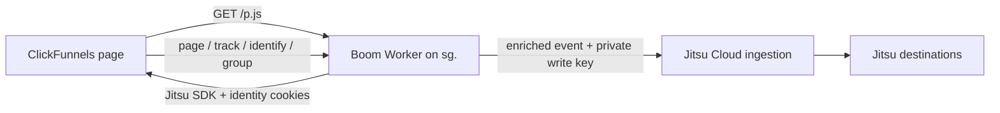

# Jitsu Cloud migration through the controlled edge proxy

Status: implemented locally; not deployed
Last reviewed: 2026-07-17

## Decision

Replace Segment browser collection and Segment Edge SDK forwarding with Jitsu while keeping the existing Cloudflare Worker as the browser-facing collection, identity, cookie, and enrichment boundary.

```text
Browser on a Boom funnel domain
  -> matching sg.<root-domain> Worker
  -> existing cookie, attribution, deduplication, and enrichment logic
  -> Jitsu Cloud ingestion
  -> Jitsu destinations
```

This design uses Jitsu Cloud only. Self-hosting Jitsu is out of scope.

The browser will still use a vendor SDK: the Jitsu browser SDK. Funnel code will continue calling methods such as `page`, `track`, `identify`, and `group`; it will not construct an individual HTTP request for every event. Jitsu documents these Analytics.js-compatible browser methods and documents the HTTP endpoints to which the Worker can forward them.

The Boom Worker remains the public tracking origin. The Jitsu write key and Jitsu Cloud hostname remain server-side. A direct CNAME to Jitsu is not part of this design because it would bypass the Worker.

## Constraints

- Jitsu must be Jitsu Cloud.
- ClickFunnels hostnames cannot be changed.
- The ClickFunnels apex records must remain DNS-only.
- ClickFunnels cannot be changed to proxy one of its paths through the Worker.
- The existing `sg.*` Worker custom domains remain the browser-facing tracking hosts.
- Existing identity continuity, attribution, enrichment, CORS, and event semantics must be preserved.

The result is same-site, cross-origin collection:

```text
Page:       https://keyboardrichchallenge.com
Collector:  https://sg.keyboardrichchallenge.com
```

These hosts are not same-origin, but they share the same registrable domain. The Worker response can therefore set parent-domain cookies using `Domain=keyboardrichchallenge.com`. Exact same-origin collection is neither available nor required to preserve the current Worker behavior.

## Target architecture



The Worker continues to run on:

```text
sg.thebookkeepingchallenge.com
sg.keyboardrichchallenge.com
sg.keyboardrich.com
sg.boomingbookkeeping.com
```

## Preservation contract

The migration is a vendor-boundary change, not a rewrite of the tracking system. Existing behavior should be moved only where Segment-specific APIs require it.

| Functionality | Current responsibility | Migration requirement |
|---|---|---|
| Tenant routing | Map each `sg.*` hostname to its trusted root domain and allowed origins | Preserve unchanged |
| Browser SDK delivery | Serve the collection SDK through the Worker | Serve Jitsu `/p.js` through the same Worker |
| Browser event transport | Receive credentialed browser events at the Worker | Use Jitsu's standard paths with a credentials-only custom Fetch implementation |
| Server-managed anonymous identity | Establish and renew an anonymous ID before events are forwarded | Preserve with a readable Jitsu cookie plus an authoritative HttpOnly mirror |
| Existing visitor continuity | Reuse the current Segment anonymous ID | Migrate `ajs_anonymous_id` before generating a new ID |
| Cross-root continuity | Decorate approved links and hydrate ActiveCampaign with `ajs_aid` | Continue `ajs_aid`, add Jitsu's `an_aid`, and keep both values identical |
| Credentialed CORS | Allow only configured tenant roots and subdomains | Preserve unchanged |
| Attribution extraction | Read page URLs, event fields, stored attribution, and ad cookies | Preserve unchanged |
| Attribution persistence | Maintain `_attr_current` and `_attr_current_js` | Preserve unchanged |
| Payload enrichment | Merge attribution and visitor context before ingestion | Preserve unchanged |
| Advertising IDs | Capture the supported Facebook, Google, Microsoft, TikTok, Reddit, and LinkedIn values | Preserve unchanged |
| `attr` event deduplication | Generate deterministic `event_id` values and suppress repeats with `_attr_event_sig` | Preserve unchanged |
| Form and order tracking | Track the existing ClickFunnels and checkout event contract | Preserve event names and properties |
| ActiveCampaign hydration | Carry the anonymous identity through the existing field and link flows | Preserve behavior; change only the identity source behind its adapter |
| Data-layer integration | Convert existing data-layer activity into analytics calls | Preserve behavior; change only the SDK adapter |
| R2 asset helper | Load the existing browser helper from R2 | Preserve unchanged |
| Upstream forwarding | Authenticate and send through `@segment/edge-sdk` | Replace with authenticated Jitsu Cloud HTTP forwarding |
| Error boundary and observability | Return controlled errors and log safely | Preserve with Jitsu-specific upstream status handling |

## Minimal required changes

| Boundary | Current Segment implementation | Jitsu implementation |
|---|---|---|
| SDK asset | Segment Analytics.js under `/route/ajs/*` | Worker-served Jitsu `/p.js` |
| Browser SDK calls | Segment globals and `analytics.user()` internals | Small Jitsu-backed, vendor-neutral adapter |
| Event routes | `/route/evs/*` | Jitsu standard `/api/s/*` and `/v1/batch` paths |
| Identity cookies | Segment `ajs_anonymous_id` plus current cross-domain behavior | Jitsu cookie pair, seeded from the existing Segment ID |
| Cross-root query parameters | Segment `ajs_aid` | Emit both `ajs_aid` and `an_aid` with the same canonical ID |
| Upstream client | `@segment/edge-sdk` | Jitsu Cloud HTTP API |
| Upstream credentials | Segment write key | Private `JITSU_WRITE_KEY` and `JITSU_CLOUD_HOST` Worker configuration |
| Dependency cleanup | Segment package and configuration | Removed from the local implementation; rollback uses version history rather than compatibility routes |

Everything else in the Worker should be treated as preserved logic. Existing helpers for tenant resolution, CORS, attribution, cookie parsing, advertising IDs, event enrichment, deterministic IDs, and duplicate suppression should be reused unless a Jitsu payload-shape difference forces a narrow adapter.

The same rule applies to the ClickFunnels browser code. Form tracking, order tracking, attribution triggers, link decoration, ActiveCampaign hydration, and data-layer behavior should not be redesigned. Segment-specific loading and identity access should move behind a small adapter.

## Public Worker endpoints

The Jitsu browser SDK should send to the Worker using Jitsu's standard paths:

```text
GET     /p.js
POST    /api/s/page
POST    /api/s/track
POST    /api/s/identify
POST    /api/s/group
POST    /api/s/event
POST    /v1/batch
OPTIONS /api/s/*
OPTIONS /v1/batch
```

The Worker forwards those requests to the corresponding Jitsu Cloud endpoints after applying the existing controls and enrichment.

## Browser SDK behavior

The browser continues to use the Jitsu SDK:

```javascript
jitsu.page();
jitsu.track("Form Submitted", properties);
jitsu.identify(userId, traits);
jitsu.group(groupId, traits);
```

Jitsu's JavaScript reference describes its API as based on and compatible with Analytics.js. That supports the existing high-level method model. It does not mean every undocumented Segment object is present.

The client adapter should provide only the capabilities the existing helper needs:

```text
ready(callback)
page(properties?)
track(name, properties, context?)
identify(userId?, traits?, context?)
getAnonymousId()
setAnonymousId(id)
getTraits()
```

The main Segment-specific incompatibility is code such as `analytics.user().anonymousId()` and `analytics.user().traits()`. The adapter should obtain the anonymous ID from the readable Worker-managed cookie or its initialized state. Existing consumers should call the adapter rather than accessing Jitsu or Segment internals.

Jitsu initialization should not emit a page event until the Worker-managed identity is available. The adapter must distinguish between the Jitsu client object being present and the client being initialized. It should run identity-dependent bootstrap work immediately when `getState().context.initialized` is true; otherwise it should wait for the client's `ready` lifecycle event after obtaining the client through `jitsuQ`. The bootstrap callback must be idempotent so multiple readiness paths cannot emit duplicate page events or bind duplicate listeners.

Jitsu documents `jitsuQ` for calls made when initialization is uncertain and documents initialization-only loading for manual page sequencing. General DOM listeners should not wait for analytics. Only the first page event, anonymous-ID propagation, and other identity-dependent work should use the Jitsu readiness gate. A readiness timeout must not be treated as successful initialization.

Loading `/p.js` from the Worker makes the SDK target the Worker's standard `/api/s/*` and `/v1/batch` routes without path rewriting. Before inserting the script, the browser adapter must provide Jitsu with a credentials-only custom Fetch implementation that preserves the requested URL and options while setting `credentials: "include"`.

Those event POSTs are cross-origin, so Jitsu's default Fetch credentials mode would omit the Worker-managed cookies. The credentials-only wrapper makes event requests carry those cookies and allows the browser to accept response cookies. This preserves HttpOnly identity authority, identity renewal, attribution persistence, cookie enrichment, and `_attr_event_sig` duplicate suppression without changing Jitsu's routes or constructing events manually. The validated payload `anonymousId` remains a fallback when cookies are unavailable.

## Server-managed anonymous identity

### The Worker should mint the ID

Yes: the Worker should generate the anonymous ID on the server when it receives the first eligible request and no usable identity already exists.

The incoming `Cookie` header includes both readable cookies and HttpOnly cookies for that request. `HttpOnly` prevents browser JavaScript from reading a cookie; it does not hide the cookie from the server receiving the request. The Worker therefore knows whether an authoritative anonymous ID exists before returning `/p.js` or forwarding an event.

No additional browser identity request is required. The first `/p.js` request is the bootstrap:

1. The browser adapter reads and validates `ajs_aid` and `an_aid` on the page URL.
2. When a valid handoff exists, the adapter makes both page parameters equal to that value.
3. The adapter requests `https://sg.<root-domain>/p.js?ajs_aid=<id>&an_aid=<id>`.
4. The Worker resolves the tenant, handoff parameters, and request cookies.
5. The Worker reuses, accepts, or generates the authoritative anonymous ID.
6. The Worker returns the Jitsu script with both identity `Set-Cookie` headers.
7. The browser stores those cookies before executing the returned script.
8. Jitsu reads the non-HttpOnly cookie and the matching `an_aid`, then uses that ID for its first event.

The page query string is not automatically copied onto the cross-origin `/p.js` request. The adapter must explicitly copy the two handoff parameters onto the script URL so the Worker can resolve the same identity before Jitsu executes.

The `/p.js` browser response must be `Cache-Control: private, no-store` because its headers are visitor-specific. The unmodified upstream Jitsu script body may be cached separately inside the Worker; each browser response must still be newly wrapped with the correct cookie headers.

The same identity resolver should run on every accepted event request. The credentials-only Fetch wrapper makes the HttpOnly mirror authoritative on normal browser events, allowing the Worker to prevent a payload from silently switching identities and to renew or repair the cookie pair. If cookies are unavailable, the validated Jitsu payload identity remains the fallback. The `/p.js` response remains the initial identity bootstrap.

### Identity precedence and Segment migration

Use this order:

1. A valid cross-root handoff represented by matching `an_aid` and `ajs_aid` values, or by either single valid parameter during migration.
2. Valid `__eventn_id_srvr` from the destination root domain.
3. Valid `__eventn_id` from the destination root domain.
4. Valid existing `ajs_anonymous_id`, normalized if legacy encoding requires it.
5. For event requests only, a valid `anonymousId` or `anonymous_id` from the Jitsu payload.
6. A new ID from `crypto.randomUUID()`.

The handoff wins because its purpose is to carry the source root's identity onto the destination root. This also matches Jitsu's current native `an_aid` behavior: its browser dependency reads `an_aid` from the page URL, gives it precedence over persisted browser state, and writes it into Jitsu's readable anonymous-ID storage.

When no valid handoff exists, the HttpOnly value wins over a conflicting readable Jitsu cookie and the Worker repairs the readable cookie. The existing Segment cookie is used before generating a new ID so cutover does not create an artificial identity break.

If both query parameters are present but differ, the adapter and Worker must reject the handoff, remove or neutralize `an_aid` before Jitsu initializes, retain an existing local identity when available, and record a redacted conflict metric. Otherwise Jitsu would automatically accept `an_aid` while the Worker accepted a different value.

Validate all accepted IDs for length and allowed characters. Redact identity query parameters and cookie values from logs.

### Cookie pair

Use Jitsu's documented cookie names:

```text
__eventn_id
__eventn_id_srvr
```

`__eventn_id` is readable by the Jitsu SDK. `__eventn_id_srvr` is the authoritative HttpOnly mirror.

```text
__eventn_id=<id>;
Domain=keyboardrichchallenge.com;
Path=/;
Max-Age=157680000;
SameSite=Lax;
Secure
```

```text
__eventn_id_srvr=<id>;
Domain=keyboardrichchallenge.com;
Path=/;
Max-Age=157680000;
SameSite=Lax;
Secure;
HttpOnly
```

The root cookie domain must come from the Worker's trusted hostname configuration. It must never come from a caller-supplied value.

### UUID uniqueness

The installed Segment Edge SDK generates a new anonymous ID with UUID v4 when the incoming context does not already provide one. The replacement should call Cloudflare's standards-based `crypto.randomUUID()`, which also produces UUID v4.

UUID v4 contains 122 random bits after its version and variant bits. It therefore provides the same practical uniqueness class as the existing Segment implementation. The approximate probability of at least one collision is:

```text
1 billion generated IDs:   9.4 × 10^-20
1 trillion generated IDs:  9.4 × 10^-14
```

Uniqueness should come from a cryptographically secure UUID generator. Do not derive the ID from time, IP address, user agent, email, or a counter.

### Cross-root-domain continuity

Cookies cannot be shared directly across separate registrable domains such as `keyboardrichchallenge.com` and `keyboardrich.com`. Preserve the existing handoff:

- Decorate approved cross-root links with both `ajs_aid` and `an_aid`.
- Write the same canonical anonymous ID into both parameters.
- Continue ActiveCampaign hidden-field hydration.
- Preserve the existing ActiveCampaign `ajs_aid` field and redirect template while adding `an_aid` to supported URLs.
- Let a valid handoff replace the destination root's prior anonymous ID.
- Copy the handoff onto the `/p.js` request so the Worker sees it before minting.
- Set the accepted value into both Jitsu cookies before the first page event.
- Keep `ajs_aid` for Segment-era compatibility; do not rely on Jitsu to interpret it.

Jitsu automatically recognizes `an_aid` in its current SDK implementation. This behavior comes from Jitsu's pinned `analytics@0.8.9` browser dependency rather than from the public Jitsu JavaScript reference. Treat it as a tested compatibility contract: retain the Worker implementation even though Jitsu also reads the parameter, and add an end-to-end browser test so an upstream SDK change cannot silently break continuity.

## Cookie durability and same-origin qualification

The expected result is durable, server-managed, first-party-domain cookies, subject to normal browser and user controls.

The browser request terminates at the Boom-controlled Worker. Jitsu Cloud receives a server-to-server request and is not the CNAME target serving the browser. This avoids the direct third-party CNAME-cloaking topology described by WebKit.

Jitsu's ITP guide describes its strongest topology as an ID endpoint on the website hostname, or on a subdomain resolving to the same IP as the website. The immutable ClickFunnels apex and the Worker do not satisfy that exact same-host/same-IP recipe. Exact same-origin is impossible under the stated DNS and ClickFunnels constraints.

That does not prevent the current functionality from being preserved:

- The Worker sets the cookie for the funnel's parent domain.
- The identity is server-minted and protected by an HttpOnly mirror.
- Every `/p.js` request can establish, renew, or repair the cookie pair before Jitsu initializes.
- Credentialed event requests can renew or repair the cookie pair and preserve cookie-based attribution behavior.
- Event requests retain identity through the validated Jitsu payload when cookies are unavailable.
- Jitsu is not exposed as a third-party browser-facing CNAME target.

No cookie can be promised to be permanent. Users can clear storage, private browsing is ephemeral, and browser policies can change. Safari return-visitor tests remain a required launch check.

## Worker event pipeline

For each Jitsu event request, preserve the current pipeline and change only the vendor-facing boundary:

1. Resolve the tenant from the `sg.*` hostname.
2. Validate `Origin` against that tenant.
3. Handle `OPTIONS` with an early return.
4. Reject unsupported paths, methods, content types, and oversized bodies.
5. Parse the single event or batch.
6. Resolve, migrate, mint, repair, or renew the anonymous identity.
7. Ensure the forwarded event uses the authoritative identity.
8. Apply the existing attribution extraction and persistence.
9. Apply the existing advertising-cookie enrichment.
10. Apply the existing deterministic `attr` event ID and duplicate suppression.
11. Preserve visitor context before the server-to-server hop.
12. Add the private Jitsu authentication header.
13. Forward to the corresponding Jitsu Cloud endpoint.
14. Return the controlled status, credentialed CORS headers, and any renewed cookies.

## Jitsu Cloud forwarding boundary

Jitsu documents these server-facing endpoints:

```text
POST https://<jitsu-cloud-site>/api/s/{event-type}
POST https://<jitsu-cloud-site>/v1/batch
```

Documented event types include `page`, `track`, `identify`, `group`, and `event`. Jitsu also documents `/v1/batch` as Segment-compatible, which provides a supported path for compatible batch payloads.

Store the upstream configuration in the Worker:

```text
JITSU_CLOUD_HOST
JITSU_WRITE_KEY
```

Add the write key only on the Worker-to-Jitsu request:

```http
X-Write-Key: <JITSU_WRITE_KEY>
Content-Type: application/json
```

The key must not appear in the browser helper, HTML, script URL, event payload, query string, or logs.

Because the Worker creates a new upstream request, explicitly preserve the visitor values Jitsu should receive:

```text
context.ip
context.userAgent
context.page
context.locale
context.screen
context.campaign / context.attribution
```

Use `CF-Connecting-IP` only after the request has terminated at Cloudflare and only under the chosen privacy policy. Do not trust a caller-supplied IP header.

## Credentialed CORS

The existing per-tenant CORS contract remains required:

```http
Access-Control-Allow-Origin: https://keyboardrichchallenge.com
Access-Control-Allow-Credentials: true
Vary: Origin
```

Preflight handling should continue to allow only the methods and headers the SDK actually uses. Unknown origins must not be echoed, and credentialed responses must never use `Access-Control-Allow-Origin: *`.

## Deferred V2: Cookiebot consent

Cookiebot gating and consent-aware collection are intentionally outside this V1 migration. The complete V2 design, implementation impact, validation checklist, and evidence are in [JITSU_COOKIEBOT_CONSENT_V2.md](JITSU_COOKIEBOT_CONSENT_V2.md).

## Code impact

### Worker

Primary files:

```text
cloudflare-workers/reverse-proxy/src/index.ts
cloudflare-workers/reverse-proxy/test/index.spec.ts
cloudflare-workers/reverse-proxy/package.json
cloudflare-workers/reverse-proxy/wrangler.jsonc
```

Expected changes:

- Add Jitsu standard route dispatch and `/p.js` delivery.
- Replace the Segment forwarding call with Jitsu Cloud HTTP forwarding.
- Add the Jitsu identity cookie pair and migrate `ajs_anonymous_id`.
- Resolve matching `ajs_aid` and `an_aid` before local cookies.
- Add Jitsu configuration and secrets.
- Remove `@segment/edge-sdk` from the Jitsu implementation.

Expected to remain behaviorally unchanged:

- Tenant and root-domain mapping.
- Origin validation and credentialed CORS.
- Attribution parsing, persistence, and merge rules.
- Advertising-cookie capture.
- `attr` event enrichment, deterministic IDs, and suppression.
- Event names and property semantics.
- Safe logging and controlled errors.

### ClickFunnels helper

Primary files:

```text
clickfunnels/src/config.js
clickfunnels/src/tracking-hosts.js
clickfunnels/src/jitsu-loader.js
clickfunnels/src/analytics-client.js
clickfunnels/src/analytics-track.js
clickfunnels/src/attr-tracking.js
clickfunnels/src/links.js
clickfunnels/src/index.js
```

Expected changes:

- Load the Jitsu SDK from the matching `sg.*` Worker.
- Replace Segment-specific global and `analytics.user()` access with the adapter.
- Point high-level `page`, `track`, `identify`, and `group` calls at Jitsu.
- Read the Worker-managed readable identity through the adapter.
- Emit matching `ajs_aid` and `an_aid` parameters on supported cross-root URLs and the `/p.js` request.

Expected to remain behaviorally unchanged:

- Form and order event triggers.
- Event names and business properties.
- Attribution refresh triggers.
- Cross-root link decoration.
- ActiveCampaign field hydration.
- Data-layer integration.
- R2 helper delivery.

File renames are optional cleanup, not a migration requirement.

## Validation checklist

### Identity and cookies

- A new visitor receives matching `__eventn_id` and `__eventn_id_srvr` values on `/p.js` without another identity request.
- `crypto.randomUUID()` is used only when no existing or transferable identity exists.
- An existing `ajs_anonymous_id` becomes the Jitsu ID without changing value.
- The HttpOnly value wins when the Jitsu cookies conflict.
- A deleted readable cookie is repaired from the HttpOnly mirror.
- Both cookies use the configured root domain, `/`, five-year max age, `Secure`, and `SameSite=Lax`.
- Matching `ajs_aid` and `an_aid` handoffs replace an existing destination identity.
- A legacy URL containing only `ajs_aid` still establishes the Jitsu identity.
- A Jitsu URL containing only `an_aid` still establishes the identity.
- Conflicting handoff values are rejected before Jitsu initialization and do not create split browser and Worker identities.
- The first page event contains the resolved identity.

### Preserved Worker behavior

- Every configured `sg.*` hostname maps to the correct tenant and cookie domain.
- Known origins receive credentialed CORS responses; unknown origins do not.
- Page URL, referrer, UTM values, click IDs, and supported advertising cookies match the current output.
- `_attr_current` and `_attr_current_js` retain their existing behavior.
- `attr` events retain deterministic event IDs and duplicate suppression.
- Form, order, identify, group, page, and custom event contracts remain stable.
- Visitor IP and user agent are not replaced with Worker egress values.

### Jitsu boundary

- Jitsu Live Events receives each supported event type through the Worker.
- Single-event and batch routes forward to the corresponding documented Jitsu endpoints.
- `X-Write-Key` is present upstream and absent from all browser-visible traffic.
- Jitsu authentication failures, rate limits, timeouts, and malformed responses produce controlled, redacted errors.
- Segment and Jitsu do not write duplicate production conversions during comparison.

### Browser flows

- First and return visits work in current Chrome and Safari.
- Cross-root links keep the anonymous identity.
- ActiveCampaign receives the expected anonymous ID.
- ClickFunnels forms and applicable checkout flows retain their existing events.
- Advertising IDs that appear after initial page load still trigger the existing refresh behavior.
- Ad blockers are tested against the Boom-owned `sg.*` hostnames.

## Cutover and rollback

1. Freeze regression fixtures for the current Segment output.
2. Add Jitsu forwarding and the Jitsu identity resolver behind the Worker.
3. Add matching `ajs_aid` and `an_aid` handoff behavior.
4. Add the Jitsu-backed browser adapter.
5. Send test traffic to isolated Jitsu destinations.
6. Compare event counts, identities, attribution, payloads, duplicates, and Safari return visits.
7. Cut the browser helper over to Jitsu through the Worker.
8. Keep the prior deployed Worker version available through deployment history during the monitoring window.
9. Remove the retired Segment key and runtime configuration after acceptance.

Rollback consists of restoring the previous Worker deployment and browser-helper artifact from version history. The Jitsu implementation does not retain Segment routes or SDK compatibility code.

## Evidence

- [Jitsu JavaScript Reference](https://jitsu.com/docs/sending-data/js-reference): Analytics.js-compatible browser API, Jitsu cookie names, cookie-domain configuration, and `page`, `track`, `identify`, `group`, and `setAnonymousId` behavior.
- [Jitsu HTML snippet](https://jitsu.com/docs/sending-data/html): Jitsu Cloud script loading, initialization-only mode, onload sequencing, and the processing queue.
- [Jitsu HTTP API](https://jitsu.com/docs/sending-data/http): `X-Write-Key`, `/api/s/{event-type}`, supported event types, and Segment-compatible `/v1/batch` ingestion.
- [Jitsu ITP mitigation](https://jitsu.com/docs/sending-data/js-reference/itp): the readable and HttpOnly cookie pair, UUID identity, five-year max age, and Jitsu's same-domain/same-IP guidance.
- [Jitsu Cloud custom domains](https://jitsu.com/docs/features/custom-domains): Jitsu Cloud's direct CNAME topology. This confirms custom-domain support but is intentionally not the selected browser path because it bypasses the Worker.
- [Cloudflare Workers Routes](https://developers.cloudflare.com/workers/configuration/routing/routes/): Worker Routes require a proxied hostname.
- [Cloudflare Worker Custom Domains](https://developers.cloudflare.com/workers/configuration/routing/custom-domains/): a Worker becomes the hostname's origin, and an existing CNAME conflicts with that setup.
- [WebKit CNAME Cloaking and Bounce Tracking Defense](https://webkit.org/blog/11338/cname-cloaking-and-bounce-tracking-defense/): Safari's distinction between ordinary first-party subdomains and third-party CNAME-cloaked response cookies.

Pinned source evidence for credentialed event transport is Jitsu's [browser configuration merge](https://github.com/jitsucom/jitsu/blob/aa2c987891131cad2664c25af2551d7daf4a9899/libs/jitsu-js/src/browser.ts#L104-L112), which preserves `window.jitsuConfig` function values, and the [event sender](https://github.com/jitsucom/jitsu/blob/aa2c987891131cad2664c25af2551d7daf4a9899/libs/jitsu-js/src/analytics-plugin.ts#L786-L823), which selects `jitsuConfig.fetch` for standard event requests. This source-backed contract requires a real-browser cutover check so a future SDK change cannot silently remove credentialed transport.

Pre-migration repository evidence showed that `@segment/edge-sdk` called UUID v4 when no anonymous ID was supplied. The replacement's `crypto.randomUUID()` preserves that identity-generation model without keeping the Segment dependency.

Current source evidence for `an_aid` is [Jitsu's pinned `analytics@0.8.9` dependency](https://github.com/jitsucom/jitsu/blob/aa2c987891131cad2664c25af2551d7daf4a9899/libs/jitsu-js/package.json#L57-L59), the dependency's [`an_aid` parsing and precedence](https://github.com/DavidWells/analytics/blob/analytics%400.8.9/packages/analytics-core/src/index.js#L162-L175), and its [anonymous-ID persistence](https://github.com/DavidWells/analytics/blob/analytics%400.8.9/packages/analytics-core/src/middleware/initialize.js#L14-L20). Because this behavior is source-backed rather than documented in Jitsu's public JavaScript reference, it requires an end-to-end contract test.
